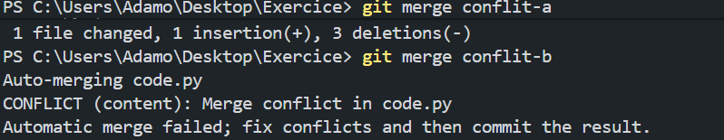

# Exercice TP1 et TP2 : Manipulation de Branches et Résolution de Conflits Git

## TP1 : Branches, Push et Merge
1. Commencer avec `code.py` initial :
   ```python
   from datetime import datetime
   print("Hello ! Il est {}.".format(datetime.now().strftime("%H:%M:%S")))
   ```
   - `git add code.py`
   - `git commit -m "Ajout du fichier code.py"`
   - `git push origin main`

2. Créer branche `refonte` :
   - `git checkout -b refonte`

3. Modifier le code :
   - Créer `module.py` :
     ```python
     from datetime import datetime
     def obtenir_temps():
         return "Hello ! Il est {}.".format(datetime.now().strftime("%H:%M:%S"))
     ```
   - Modifier `code.py` :
     ```python
     from module import obtenir_temps
     print(obtenir_temps())
     ```
   - `git add module.py code.py`
   - `git commit -m "Ajout du module et mise à jour du code"`
   - `git push origin refonte`

4. Merger dans main :
   - `git checkout main`
   - `git merge refonte`
   - `git push origin main`

## TP2 : Conflit de Merge
1. Créer `conflit-a` :
   - `git checkout -b conflit-a`
   - Modifier `code.py` : `print("Version A du code")`
   - `git add code.py`
   - `git commit -m "Modification version A"`

2. Retour sur main : `git checkout main`

3. Créer `conflit-b` :
   - `git checkout -b conflit-b`
   - Modifier `code.py` : `print("Version B du code")`
   - `git add code.py`
   - `git commit -m "Modification version B"`

4. Merger conflit-a : `git merge conflit-a` (réussi)

5. Merger conflit-b : `git merge conflit-b` (conflit !)

   

   Conflit visible dans `code.py` avec `<<<<<<< HEAD`, `=======`, `>>>>>>> conflit-b`.

6. Résoudre :
   - Choisir la version : `print("Version finale du code après résolution du conflit")`
   - `git add code.py`
   - `git commit -m "Résolution du conflit entre conflit-a et conflit-b"`
   - `git push origin main`

## Fichiers
- `code.py` : Final après résolution
- `module.py` : Fonction utilisée
- `capture_conflit.png` : Screenshot du conflit
